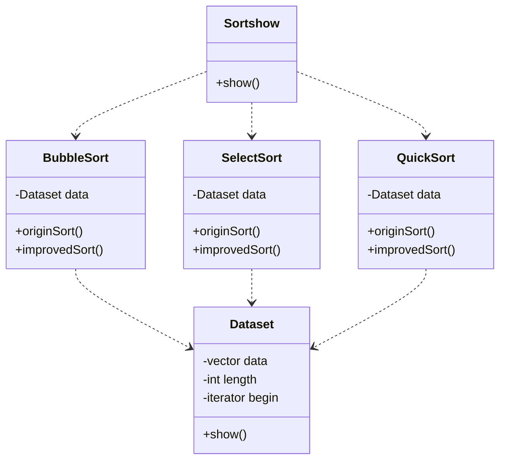

```mermaid
classDiagram
Sortshow ..> BubbleSort
Sortshow ..> SelectSort
Sortshow ..> QuickSort
BubbleSort ..> Dataset
SelectSort ..> Dataset
QuickSort ..> Dataset

class Sortshow{
	+show()
}
class BubbleSort{
	-Dataset data
	+originSort()
	+improvedSort()
}
class SelectSort{
	-Dataset data
	+originSort()
	+improvedSort()
}
class QuickSort{
	-Dataset data
	+originSort()
	+improvedSort()
}
class Dataset{
	-vector<T> data
	-int length
	-iterator begin
	+show()
}
```

